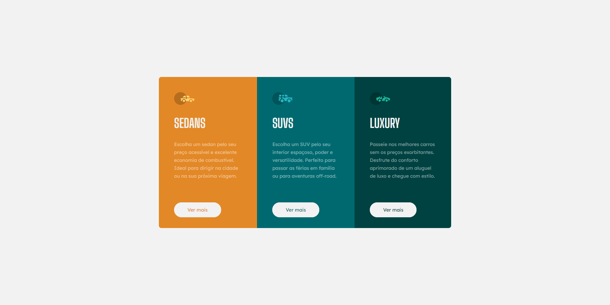

<h1 align="center">
  Cars Project
</h1>

<div align="center">
  
</div>

<p align="center">
  <a href="#project">Project</a>&nbsp;&nbsp;&nbsp;|&nbsp;&nbsp;&nbsp;
  <a href="#-technologies">Technologies</a>&nbsp;&nbsp;&nbsp;|&nbsp;&nbsp;&nbsp;
  <a href="#-Getting started">Getting started</a>&nbsp;&nbsp;&nbsp;|&nbsp;&nbsp;&nbsp;
  <a href="#-layout">Layout</a>&nbsp;&nbsp;&nbsp;|&nbsp;&nbsp;&nbsp;
  <a href="#-license">License</a>
</p>

<br>

<p align="center">
  
</p>


## 💻 Projeto

Atividade pratica para a faculdade com o objetivo de desenvolver técnicas em HTML e CSS, usando essas habilidades para desenvolver uma pagina com 3 opções de compra de carros que também é responsiva para mobile!


## 🧪 Technologies

This project was developed using the following technologies:
 
- [HTML](https://developer.mozilla.org/pt-BR/docs/Web/HTML)
- [CSS](https://developer.mozilla.org/pt-BR/docs/Web/CSS)

## 🚀 Getting started

Clone the project and access the folder.

```bash
$ git clone https://github.com/MaykonRaphael/cars.git
$ cd cars
```

Open the index.html in your browser.

## 🔖 Layout

You can view the project layout through the links below:

- [Layout](https://www.figma.com/file/t81qJlFRy2EzEu34OuOcPR/3-column-preview-card-component?node-id=0%3A21&mode=dev)

Remembering that you need to have a [Figma](http://figma.com/) account to access it.

You also can view the project in your browser through the links below:
- [Netlify](https://cars-maykonraphael.netlify.app)

## 📝 License

This project is licensed under the MIT License. See the [LICENSE](LICENSE.md) file for details.

---
<p align="center">
  Made by Maykon Raphael 👋
</p>